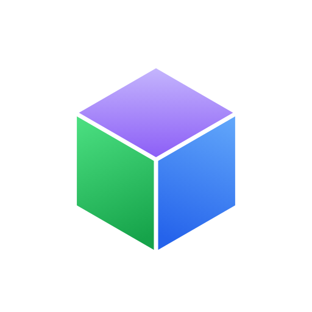

# Proteus 品牌资产（立方体）

**方向**：多彩立方体。图形**本体三面各持一色**（不是「纯色底 + 白字」）——
Fluent / Kotlin / Jetpack 一路的**多色几何**语言，比单色更有设计密度。

**隐喻**：等距立方体 = 一套源码；**三个面 = 多个渲染目标**；面间白色内缝 = 「同一体的多面」。

> **统一品牌标识**：立方体已同时用于 ① 小程序头像（本目录）② 官网导航 logo
> （`website/src/components/BrandMark.vue`）③ 网站图标 favicon（`website/public/favicon*.{svg,png}`）。
> 三处同源，改一处视觉请同步 —— 几何坐标见下方「几何」。

## 主选（`avatar`）



白色圆角方形容器 + 三面渐变立方体（**紫 `#8b5cf6` / 绿 `#16a34a` / 蓝 `#2563eb`**）。
每面自带「上亮下暗」渐变 → 既有立体结构又是多色。内部三条棱描白（`7px` 圆头），
让三面边界清晰可辨；**外轮廓不描边**（靠面色收边，在任意底色上都干净）。

| 文件 | 用途 |
|---|---|
| `avatar.svg` | 源文件（可编辑，几何精确） |
| `avatar-512.png` | **512×512 成品（推荐上传件）** |
| `avatar-1024.png` | 1024×1024 高清 |
| `avatar-round.png` | 圆形裁切预览（非上传件） |

## 变体

| 文件 | 说明 |
|---|---|
| `avatar-transparent.svg` / `-512.png` / `-1024.png` | **透明底**（无容器、无底色）——供自定义底色/深色界面嵌入 |
| `avatar-dark.svg` / `-512.png` / `-1024.png` | **深色底** `#141419` ——暗色商店/文档场景 |

## 官网集成（logo + favicon）

| 位置 | 文件 | 说明 |
|---|---|---|
| 导航左上角 logo | `website/src/components/BrandMark.vue` | 内联 SVG（渐变版，24px）；原 `◆` conic 色片已弃用 |
| 网站图标 | `website/public/favicon.svg` + `favicon-{16,32}.png` + `apple-touch-icon.png` + `icon-{192,512}.png` | **平涂高对比版**（渐变在 16px 会糊）+ **立方体满幅**（占比最大）+ **白底**（明/暗标签栏都可辨） |
| 引入 | `website/index.html` | `<link rel="icon">`（SVG 优先 + PNG 回退）+ `apple-touch-icon` + `mask-icon` |

favicon 用独立的 **满幅平涂**几何（L=196，几乎撑满；色 `#a78bfa/#34d399/#3b82f6`），
与头像的渐变版有意区分——16px 下平涂更锐利。

## 小尺寸可读性

已降到 24 / 32 / 40 / 48 / 64 / 96 / 128px 实测：**@32 仍能清晰读出「三面立方体」**
（三色分面 + 白缝在极小尺寸下依然可辨）。小程序头像以小尺寸圆形展示（列表/详情约 40–96px），胜任。

## 几何（512 画布 · 精确值）

```
等距立方体 L=150，中心 (256,262)
顶面   256,112    385.9,187   256,262   126.1,187
左面   126.1,187  256,262     256,412   126.1,337
右面   256,262    385.9,187   385.9,337 256,412
内缝   UL(126.1,187)→C(256,262)、UR(385.9,187)→C、C→B(256,412)
容器   白色圆角方形 size=512 rx=116（≈22.7%，贴近 iOS squircle）
```

> ★制图注意：一页多图标时渐变 `id` 必须唯一（否则后定义的会覆盖前者，是 SVG 常见坑）。

## 色值

| 面 | 渐变（上 → 下） |
|---|---|
| 顶 | `#c4b5fd` → `#8b5cf6` |
| 左 | `#4ade80` → `#16a34a` |
| 右 | `#60a5fa` → `#2563eb` |
| 深色版 | 顶 `#c4b5fd/#8b5cf6`、左 `#34d399/#0d9488`、右 `#38bdf8/#2563eb` |

## 重新生成

纯 SVG、无外部依赖：

```bash
qlmanage -t -s 512 -o . avatar.svg          # macOS 系统工具
# 或浏览器打开 avatar.svg 截图；或 sharp / resvg / rsvg-convert
```

**上传微信小程序头像**：登录 [微信公众平台](https://mp.weixin.qq.com) → 设置 → 基本设置 →
小程序头像（正方形、建议 512×512、PNG/JPG、<2MB、不透明）。**该设置在微信后台，不在代码仓库内**
（故主选容器用不透明白底；若要透明底请用 `avatar-transparent`，但微信通常要求不透明）。
