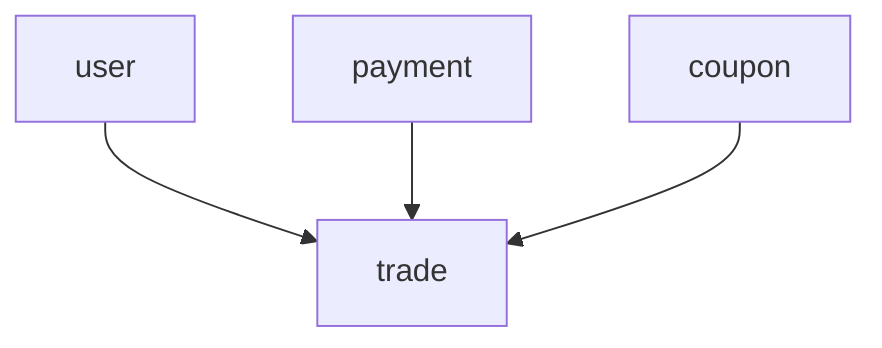

# M3 DependencyGraph（循环检测 + 拓扑排序）

## 目标

编译期构建模块依赖图，检测循环依赖、版本冲突，输出拓扑序供打包器使用。

## 核心算法

### 1. 构建图

```ts
class DependencyGraph {
  private nodes = new Map<string, ModuleNode>()
  private edges = new Map<string, Set<string>>()

  addModule(config: ModuleConfig) { ... }
  addDependency(from: string, to: string, versionRange: string) { ... }

  // 检测循环依赖（DFS 三色标记）
  detectCycles(): Cycle[] { ... }

  // 拓扑排序（Kahn 算法）
  topologicalSort(): string[] { ... }

  // 生成 chunk 分组（对齐 Router M7.1）
  chunkGroups(): Map<string, string[]> { ... }
}
```

### 2. 循环检测（DFS）

```
白：未访问
灰：正在访问（当前 DFS 路径上）
黑：已完成

遇到灰节点 → 发现环 → 记录环路径 → 报错
```

错误信息示例：
```
Circular dependency detected:
  trade → payment → coupon → trade

Suggestion: extract shared logic into a common module, or use event-based communication.
```

### 3. 拓扑排序（Kahn）

用于确定初始化顺序：被依赖者先 init。

```ts
topologicalSort(): string[] {
  const inDegree = new Map<string, number>()
  // 计算入度...
  const queue = [...nodes with inDegree === 0]
  const result: string[] = []
  while (queue.length) {
    const node = queue.shift()!
    result.push(node)
    // 减入度、入队...
  }
  if (result.length !== nodes.size) throw new CycleError(...)
  return result
}
```

## 产物

编译期生成 `.proteus/module-graph.json`：

```json
{
  "modules": [
    { "name": "user", "chunk": "user", "dependencies": [] },
    { "name": "trade", "chunk": "trade", "dependencies": ["user", "payment"] }
  ],
  "chunks": {
    "user": ["user"],
    "trade": ["trade", "coupon"]
  },
  "initOrder": ["user", "payment", "coupon", "trade"]
}
```

该 manifest 被以下消费：
- **Router M7.1**：`chunk` → `subPackages[root]` 映射
- **Skyline 打包器（M5）**：`chunks` → `subPackages` 配置
- **preloadRule 生成器**：`initOrder` → 预加载顺序

## 可视化

`proteus audit module --graph` 输出 Mermaid：



## 测试

- 正常 DAG → 拓扑序正确
- 简单环（A→B→A）→ 报错且提示环路径
- 复杂环（A→B→C→A）→ 报错
- 自环（A→A）→ 报错
- 版本冲突 → 报错
- 大图（100 模块）→ 性能 < 100ms
